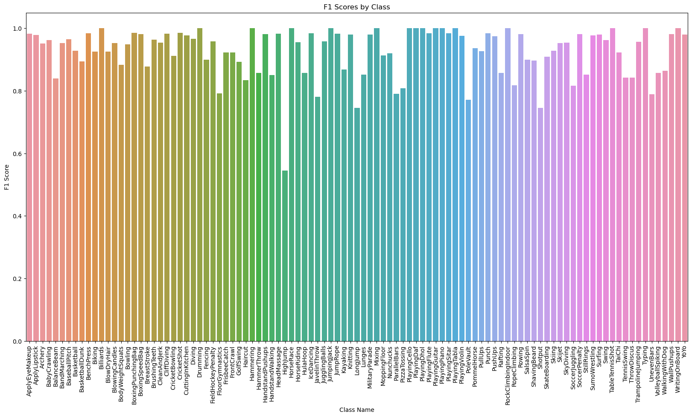

# Project Title: FrameFlow

In the landscape of sports analytics within the UK, numerous organisations are sitting on vast but largely untapped reserves of game footage and athlete training videos. This wealth of video data, ripe with potential insights into player performances, strategies, and training efficacy, remains underexploited, primarily due to its unorganised and unclassified state.

Acknowledging the hidden opportunities within this seemingly chaotic mass of data, the initiative is set to leverage the capabilities of Machine Learning (ML) and Artificial Intelligence (AI) to navigate through and make sense of this extensive video repository. The ambition is to unlock valuable insights that have remained inaccessible due to the challenges posed by sparse metadata, the variable quality and angles of footage, and the significant computational resources required for effective analysis.

To illustrate the practicality of deploying deep learning techniques for sports video classification, this project will employ the UCF101 dataset as an initial step towards demonstrating feasibility. The UCF101 dataset, renowned for its comprehensive compilation of videos capturing a wide array of human activities, provides an excellent testbed for developing and honing video classification models. By tailoring these models to meet the specific demands of sports analytics, the project aspires to develop a scalable and efficient system capable of deriving actionable insights with minimal manual oversight.

At the heart of this deep learning approach, Convolutional Neural Networks (CNNs) stand out as the preferred initial choice, given their proven efficacy in handling video and image data. This technical preference, however, is presented in a non-technical manner to ensure accessibility and comprehensibility for all stakeholders.

The overarching aim is not only to validate the feasibility of advanced video analysis techniques within the realm of sports but also to lay the groundwork for their wider application. By revolutionising the way sports organisations utilise their video archives, the project envisions enabling real-time game analysis, elevating training programmes, and ushering in a new era of data-driven decision-making in the sports industry.

The focus of FrameFlow is to apply transfer learning techniques to adapt these sophisticated models to the domain of action recognition in video data.
The final technical analysis and running of this project is focused on this [notebook](https://github.com/GwriPennar/FrameFlow/blob/main/Final%20FrameFlow%20EfficentNetB0%20UCF_101%20Full%20Dataset%20v1-31%20GPU%20RUN%2050%20EPOCH.ipynb)
There are other notebooks in this repo which have showcased examples of work on subset data and other models for comparison aiding the development process.

## NON-TECHNICAL EXPLANATION OF THE PROJECT

FrameFlow is a project that aims to classify videos into different categories based on the actions or events happening in them. It leverages the power of deep learning techniques and pre-trained models to achieve this task efficiently. The final project uses a technique called "transfer learning," where a pre-trained model (a model that has already learned to recognize visual patterns from a large dataset) is fine-tuned on a specific video dataset to adapt it for video classification.

 - The project starts by preparing the video data from the UCF101 dataset. It extracts individual frames from each video and organizes them along with their corresponding labels (the action categories). This process helps the model learn from the visual information in the videos.

- Next, the pre-trained EfficientNetB0 model is loaded, but its weights are initially frozen. This means that the model's existing knowledge of visual features is preserved. Then, additional custom layers are added on top of the pre-trained model to adapt it for video classification.

- During the training process, the model learns to recognize patterns in the video frames and associate them with the correct action categories. It does this by processing each frame through the pre-trained model to extract visual features, and then combining those features across all frames to make a final prediction.

- To ensure the model doesn't overfit (memorize the training data too well), techniques like early stopping and splitting the data into training, validation, and testing sets are employed. Early stopping stops the training process when the model's performance on the validation set stops improving, preventing overfitting.

- After training, the model's performance is evaluated on the testing set, which it has never seen before. This helps assess how well the model can generalize to new, unseen videos.

- Throughout the process, the project employs various techniques to optimize the model's hyperparameters (settings that affect its learning process) and visualize its performance using metrics like accuracy, confusion matrices, and F1 scores.

- The end result is a model that can take a new video as input and accurately classify the action or event happening in it, leveraging the power of pre-trained models and transfer learning to achieve high accuracy without starting from scratch.

## DATA

The project uses the UCF101 dataset, which is a widely used benchmark for video classification tasks. The dataset consists of 13,320 videos from 101 different action categories, including human actions like "Basketball Shooting," "Bowling," "Horse Riding," and many more. The videos are split into training, validation, and testing sets to train and evaluate the model effectively. More information is on the data sheet on this project and on https://www.crcv.ucf.edu/research/data-sets/ucf101/

## HYPERPARAMETER OPTIMSATION

One of the critical aspects of training deep learning models is finding the optimal hyperparameters, such as learning rate, batch size, and number of epochs. In this project, various techniques were employed to optimize these hyperparameters, including:

Early Stopping: A technique to prevent overfitting by stopping the training process when the model's performance on the validation set stops improving. This was observed in the main project where early stopping occurred after 7 epochs - indicating that the model had converged.

 - In the context of the FrameFlow project, which involves training a deep neural network on a large video dataset, early stopping was a good idea for the following reasons:
 - Prevent Overfitting: As the model trains for more epochs, it may start to memorize the training data instead of learning the underlying patterns. Early stopping helps to stop the training process before the model overfits, ensuring that it generalizes well to new video samples.
 - Efficient Training: Training deep learning models can be computationally expensive, especially when working with large datasets like UCF101. Early stopping allows the training process to terminate automatically when the model's performance stops improving on the validation set, saving computational resources and time.
 - Avoid Degradation: In some cases, continuing to train a model beyond a certain point can lead to a degradation in performance on both the training and validation sets. Early stopping prevents this degradation by stopping the training process at the optimal point.
- Hyperparameter Tuning: Early stopping can be used in conjunction with other hyperparameter tuning techniques, such as Bayesian optimization and grid search. By incorporating early stopping, the hyperparameter search can be more efficient and effective, as the training process terminates automatically when the optimal performance is achieved.

In the FrameFlow project, early stopping was implemented using a callback function provided by TensorFlow/Keras. This callback monitored the validation loss during training and stopped the training process if the validation loss did not improve for a specified number of epochs (in this case, 2 epochs). This approach helped to prevent overfitting, optimize computational resources, and ensure that the model's performance was maximized on the validation set, which is a good indicator of its generalization capability.

Bayesian Optimization: A method that uses probabilistic models to search for the optimal set of hyperparameters efficiently. There were a number of challenges and the focus was on the learning rate for the main training loop. 

 - Complexity and Sensitivity: Bayesian optimization, while powerful, can be quite complex and sensitive to the choice of kernel, acquisition function, and their hyperparameters. In our case, we experimented with different kernels (RBF, Matern) and adjusted various parameters (length_scale, noise_level, beta for exploration-exploitation balance), but still faced issues with convergence and the learning rate getting stuck at suboptimal values.

 - Narrow Search Space: Given the performance of the default learning rate in TensorFlow's Adam optimizer, our search space was relatively narrow, centered around this default value. Bayesian optimization is generally more advantageous in larger, high-dimensional search spaces where random or exhaustive searches are impractical. In our narrow search space, the added complexity of Bayesian optimization did not provide a significant advantage over simpler methods.

 - Repeatability and Stability: The stochastic nature of Bayesian optimization, coupled with the non-convexity of neural network training, led to less repeatable and stable outcomes. This variability made it difficult to confidently identify the optimal learning rate.

- Performance Overhead: Bayesian optimization involves fitting a probabilistic model (Gaussian Process in my case) to the observed outcomes, which introduces additional computational overhead. For a relatively simple hyperparameter like the learning rate and a narrow search space, this overhead might not be justified, especially when simpler methods can achieve comparable results with less complexity.

 - Model Specificity: The effectiveness of Bayesian optimization can be highly dependent on the specific model and task. In our case, with a pre-trained EfficientNetB0 and a focus on fine-tuning with additional custom layers for video classification, the nuances of this setup might not have aligned well with the assumptions and strengths of Bayesian

Grid Search: An exhaustive search approach where a range of hyperparameter values is specified, and the model is trained and evaluated for each combination.

 - The best learning rate found was 0.0015, with the corresponding lowest validation loss being approximately 0.0791. This suggests that among the explored learning rates, 0.0015 was the most effective for training the model, balancing the speed of learning and the model's ability to generalize well to new data. The grid search was straightforward and provided a clear outcome, making it a suitable choice for optimizing the learning rate in this scenario.

Batch Size: This was set to 2 to manage the model's memory usage effectively and maintain consistency with previous parameter settings. This small batch size facilitated more frequent model updates, potentially leading to faster convergence. However, it's important to consider that the optimal batch size can vary based on the task, model architecture, and available computational resources.

## RESULTS

Training/Validation/Test Scores:

- The model achieved a test accuracy of approximately 92.76% on the UCF101 dataset.
- The training accuracy reached 97.54%, and the validation accuracy was 92.04% after 50 epochs.

F1 Scores:
- The project provides visualizations of the F1 scores for each class.
- The average F1 score across all classes was 0.927.

Confusion Matrix:

- The confusion matrix visualizations show the number of correct and incorrect predictions for each class.
- These matrices help identify classes that the model may have struggled with or performed well on.
- These appear in full on each of the different notebooks.
  

Precision and Recall:

The model demonstrates strong performance across a wide range of activities, as evidenced by high precision, recall, and F1 scores for each class. The metrics indicate the model's ability to accurately identify specific activities while minimizing both false positives and false negatives. Notable observations include:

- High Precision Classes: Several classes, such as "PlayingDhol", "PlayingGuitar", and "RockClimbingIndoor", achieved perfect precision scores (1.0), indicating no false positives for these activities.
- High Recall Classes: Many activities, including "ApplyEyeMakeup", "Archery", and "PlayingFlute", have perfect recall scores (1.0), suggesting that the model successfully identified all relevant instances of these activities.
- Outstanding F1 Scores: A number of classes, such as "PlayingDhol", "PlayingGuitar", and "RockClimbingIndoor", achieved perfect F1 scores (1.0), showcasing the model's exceptional balance between precision and recall for these activities.
- Variability in Performance: Some classes, like "PoleVault" and "RopeClimbing", have lower F1 scores (e.g., 0.7719 and 0.8182 respectively), which may indicate challenges in classifying these specific activities accurately. These cases provide opportunities for further model refinement.
- Average Metrics: The model's overall performance is robust, with average precision, recall, and F1 scores of 0.934, 0.925, and 0.926 respectively. These averages reflect the model's strong general performance across the board.

The model exhibits strong and consistent performance across a diverse set of activities, with high scores in precision, recall, and F1 metrics for the majority of classes. While the performance is generally high, the variability in scores for certain activities highlights areas for potential improvement. The detailed class-by-class breakdown demonstrates the model's capabilities and areas for further development, providing valuable insights for both current use and future iterations.

Training and Validation Curves:

These curves help identify potential overfitting or underfitting issues and monitor the model's performance over time.
Overall, the results demonstrate the effectiveness of the FrameFlow approach in leveraging pre-trained models and transfer learning for video classification tasks. The model achieved high accuracy on the test set, and the provided visualizations and metrics offer insights into the model's performance across different classes and during the training process.

## OTHER MODELS
Initially, I explored using a ResNet model on a subset of the UCF101 dataset, following a TensorFlow documented example. The model performed very well utilising a GPU but took significantly longer to train and requires more investigation.
