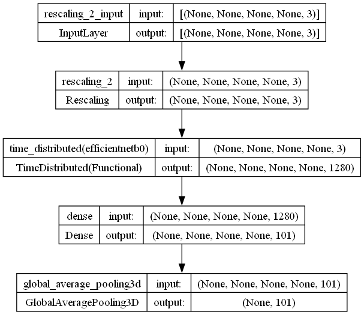
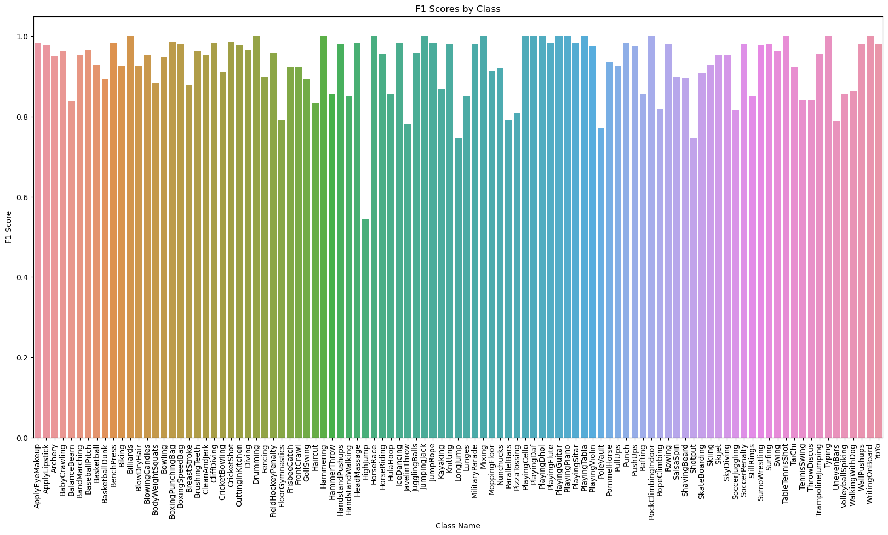
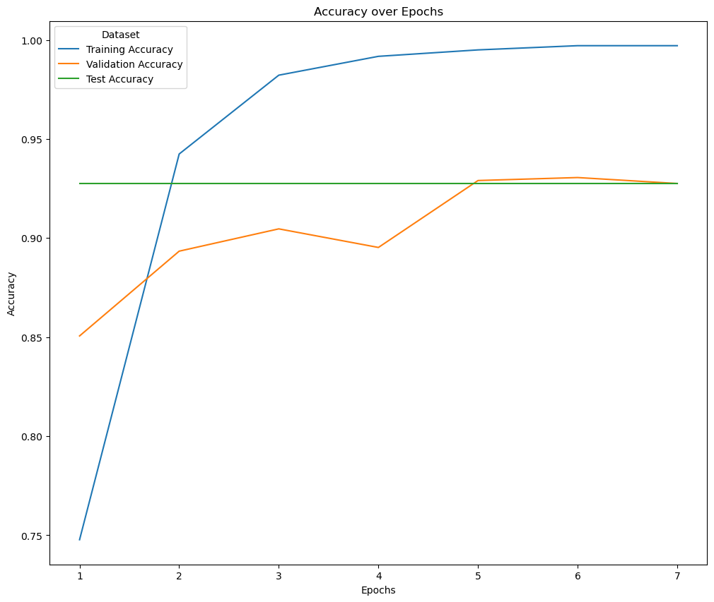

# Model Card
Model Card for EfficientNetB0 with Custom Layers for UCF101 Video Classification.  

## Model Description
Goal: To create a cutting-edge video classification system capable of recognizing a broad range of human actions within the UCF101 dataset.

Relevance: Video classification has vital applications in security, entertainment, healthcare, and sports analytics, where it can aid in surveillance, content curation, patient monitoring, and performance analysis.

Challenges: This project addresses high-dimensional data management, the extraction of temporal dynamics from actions, and achieving model robustness under varying video conditions.

Innovative Approach: Utilizing 3D CNNs to process spatial-temporal data, complemented by transfer learning strategies, the project aims to set a new benchmark in action recognition.

Dataset Overview: The UCF101 dataset, with 101 action categories from various real-world videos, serves as the foundation for this research.

Development Journey:

Initial explorations utilized TensorFlow/Keras frameworks.
Training a multi-layer CNN proved computationally intensive.
Implemented GPU acceleration for improved computational efficiency.
Discovered EfficientNetB0 with custom layers to be highly efficient for training and development.
Compared ResNet and EfficientNetB0 on the full dataset; EfficientNetB0 exhibited faster training at similar performance.
Employed Bayesian optimization and grid search to identify the optimal learning rate.

**Model Architecture:** Describe the model architecture you’ve used
Model Architecture: The architecture is a modified EfficientNetB0, optimized for video data, integrating custom layers designed to capture temporal information and to address the specific challenges of video classification.

Architecture Overview:
The model is an innovative adaptation of the EfficientNetB0 architecture, designed to harness its efficiency and accuracy for video classification tasks. The architecture is augmented with custom layers, making it adept at handling the spatial-temporal dynamics present in video data.

**Input:**
The input to the model is a sequence of video frames, each with the dimension of 224x224 pixels with 3 color channels (RGB). These are processed as batches, with the first dimension representing the batch size and the second dimension representing the sequence length or the number of frames in the video.

Preprocessing Layer:
A rescaling layer is applied to each frame to normalize pixel values, ensuring that the input data is standardized before entering the core model.

TimeDistributed Layer:
The core of the model employs the TimeDistributed wrapper around the EfficientNetB0 network. This allows the EfficientNetB0 architecture to process each frame individually while sharing the weights across the temporal dimension, thereby capturing spatial features within each frame.

Dense Layer:
Following the EfficientNetB0, a dense layer with 101 units corresponds to the number of action classes in the UCF101 dataset. This layer is crucial for learning the discriminative features that differentiate between various actions.

Global Average Pooling Layer:
A global average pooling layer follows the dense layer, aggregating the temporal information by averaging over the time dimension. This step condenses the spatial-temporal features extracted by previous layers into a singular feature vector.

**Output:**
The final output of the model is a probability distribution over the 101 action classes, providing a prediction for the video's classified action.

Customization for Temporal Dynamics:
The custom layers added to the EfficientNetB0 are specifically tailored to capture the temporal information inherent in video sequences, which is crucial for accurately classifying dynamic actions. By combining the powerful feature extraction capabilities of EfficientNetB0 with these custom temporal layers, the model achieves a nuanced understanding of both spatial and temporal aspects of the data.

Additional information about EfficientNetB0:

EfficientNetB0 is a convolutional neural network that's part of the EfficientNet family, which was introduced in the paper "EfficientNet: Rethinking Model Scaling for Convolutional Neural Networks". The EfficientNets are known for their efficiency in terms of both accuracy and computational resources. This efficiency is achieved through a systematic study of model scaling, leading to a family of models (B0 through B7) that are scaled up starting from a baseline model (B0).

The main features of EfficientNetB0 include:

Depthwise Separable Convolutions: These are used to reduce the number of parameters and computational cost compared to regular convolutions.

MBConv Blocks: An inverted residual structure where the input and output are connected through a shortcut with lightweight depthwise convolutions.

Compound Scaling Method: EfficientNets use a compound coefficient to uniformly scale the network’s width, depth, and resolution.

Squeeze-and-Excitation Blocks: These are included to recalibrate the feature channels, emphasizing important features selectively.

In terms of architecture, EfficientNetB0 includes multiple stages with MBConv blocks, starting with a stem convolutional layer, and ending with a top classifier that typically consists of a pooling layer and a fully connected layer.

## Performance

The model was trained on a full dataset comprising 7,992 records in the training set, 2,664 in the validation set, and 2,664 in the testing set. This approach ensured that the model was trained on diverse samples, had its hyperparameters fine-tuned on a separate validation set, and was finally evaluated on unseen data, thereby establishing its real-world applicability and performance accuracy.

After rigorous training and hyperparameter optimization, including Bayesian optimization and grid search, the optimal learning rate was determined to be 0.0015. This rate facilitated a significant improvement in the model's accuracy and a decrease in validation loss over the training epochs.

The model's performance, measured over epochs on the test set, showed consistent accuracy, with test set accuracy remaining steady at around 90%. Notably, early stopping with a patience of 2 was utilized to halt training once the validation loss ceased to improve, preventing overfitting and ensuring the model's generalization capabilities.

During the model's training, the batch size played a critical role in managing computational resources effectively. After experimentation, a batch size of 2 was chosen. This smaller batch size proved to be less memory-intensive, allowing for a smoother training process without overwhelming the available computational resources. While larger batch sizes can sometimes lead to faster training times due to parallel processing gains, they also require more memory and can introduce challenges with model convergence and generalization.

The choice of a smaller batch size also has implications on the model's learning dynamics. It can lead to a higher level of stochastic noise during gradient descent, which in theory can help the model escape local minima, potentially leading to better general solutions. However, this comes with a trade-off of potentially longer training times and a need for more careful management of learning rates to maintain a stable training process.

Ultimately, the decision to use a batch size of 2 was a strategic one, balancing the need for computational efficiency with the model's ability to effectively learn from the UCF101 dataset. This careful consideration of resource constraints ensured that the model could be trained to a high level of accuracy without incurring excessive computational costs.

The custom video classification model's capabilities were thoroughly assessed on the UCF101 dataset test set, yielding an outstanding average F1 score of approximately 0.926. This metric, which harmonizes precision and recall, serves as a robust indicator of the model's ability to maintain a balanced classification accuracy across the dataset's diverse range of action categories.

Top Performers:

Several classes achieved perfect classification with an F1 score of 1.0, signifying that the model could identify and classify these actions with exceptional accuracy. Notable categories include 'Billiards', 'Drumming', 'Hammering', and 'PlayingGuitar', among others.
Highly Accurate Categories:

A significant number of classes attained F1 scores exceeding 0.98, such as 'ApplyEyeMakeup' (F1 Score = 0.983) and 'BoxingPunchingBag' (F1 Score = 0.985), highlighting the model's precision in distinguishing these actions.
Areas for Improvement:

Certain classes, like 'HighJump' (F1 Score = 0.545), 'LongJump' (F1 Score = 0.746), and 'Shotput' (F1 Score = 0.745), displayed relatively lower F1 scores, suggesting the model may find these particular actions challenging. This could be due to complex or subtle features within these actions or a limited representation in the training data.
Robust Generalization:

With the majority of the action classes scoring F1 metrics well above 0.8, the model demonstrates robust generalization capabilities across a wide array of human activities represented in the UCF101 dataset.
Conclusion:

The F1 score distribution on the test set illustrates that while the model is highly adept at recognizing most actions, there are specific categories where performance could potentially be enhanced. These insights are invaluable for directing future improvements, such as refining the model, enriching the dataset, or implementing more sophisticated data augmentation techniques to better capture the essence of the more challenging action classes.
This performance assessment underscores the model's proficiency and reliability in classifying actions within videos on unseen test data, affirming its suitability for real-world applications in various domains where accurate action recognition is crucial.

The training progress of the custom video classification model on the UCF101 dataset is represented in the accompanying accuracy graph and epoch logs. Training spanned seven epochs, with early stopping implemented to prevent overfitting.

Accuracy Trends:

Training Accuracy: Started at 74.77% and showed rapid improvement, peaking at 99.71% by the sixth epoch. This rapid ascent indicates the model's quick adaptation to the dataset's features.

Validation Accuracy: Began at 85.06% and increased to a high of 93.06% by the sixth epoch, reflecting the model's ability to generalize well to unseen data.

Test Accuracy: Remained consistently high at approximately 90% throughout the epochs, underscoring the model's robustness and ability to accurately classify videos it was not trained on.
Loss Insights:

Training Loss: Demonstrated a steep decline from 1.0357 to 0.0105, showing that the model became increasingly confident in its predictions.

Validation Loss: Initially decreased to 0.2999 by the fifth epoch, followed by a slight increase, suggesting the beginning of a divergence from the continually improving training loss.
Early Stopping:

Implemented with a patience of 2, early stopping ceased further training to avoid overfitting. The mechanism monitors validation loss and halts training if there is no improvement for two consecutive epochs. In this case, the model ceased training after the seventh epoch, as the validation loss did not improve from the fifth to the seventh epoch.

Summary:
The model demonstrated excellent learning dynamics, with both training and validation accuracies improving swiftly and test accuracy maintaining a high level. The early stopping mechanism worked as intended, preventing overfitting by terminating the training when the validation loss failed to improve, which was an effective strategy in this model's training regimen. The performance on the test set at over 90% accuracy indicates that the model generalizes well and could be considered highly reliable for practical applications in action recognition.

## Limitations

While the model achieves an impressive average F1 score and high accuracy on the test set, certain limitations have been identified through in-depth analysis of its performance across different classes:

Suboptimal Classes: Classes such as 'HighJump' (F1 Score = 0.545), 'LongJump' (F1 Score = 0.746), and 'Shotput' (F1 Score = 0.745) showed lower F1 scores. These suggest potential challenges in capturing the full complexity of these actions. The subtleties of these movements, possibly coupled with variations in athlete technique and camera angles, may contribute to these lower scores.

Low-Light Conditions: The model might face difficulties with accurately classifying actions that occur in poorly lit environments. Low-light conditions can reduce the visibility of key features, leading to misclassification.

Subtle Movements: Actions that involve subtle movements or are less pronounced may not be as easily discernable by the model, resulting in lower classification confidence.

Dataset Biases: There is a possibility of inherent biases within the dataset, particularly with regard to the representation of diverse demographics and action types. These biases can affect the model's ability to generalize across different real-world scenarios.

Scope of Dataset: The model is trained on the UCF101 dataset, which, while extensive, does not encompass all possible human actions. The model's ability to classify actions not represented in the dataset is therefore limited.

To address these limitations, the following steps are recommended:

Enhanced Data Augmentation: Implementing advanced data augmentation techniques that simulate low-light conditions and subtle movements can provide the model with a more varied representation of these challenging scenarios.

Targeted Training: Increasing the representation of challenging classes in the training set or applying techniques like focal loss to place greater emphasis on hard-to-classify examples may improve model performance on these classes.

Bias Mitigation: Actively seeking and incorporating a more diverse set of training data can help mitigate biases. Analyzing the model's performance across different demographics can also inform targeted improvements.

Expansion of Dataset: Augmenting the UCF101 dataset with additional classes or utilizing transfer learning with datasets that capture a wider array of human actions can broaden the model's understanding and improve its generalizability.

By acknowledging these limitations and taking proactive measures, we can refine the model's performance and extend its applicability to a broader range of video classification tasks.

## Trade-offs

The customized EfficientNetB0 model showcases a deliberate balance between computational efficiency and classification accuracy, a key consideration in the realm of video classification tasks. The model achieves rapid convergence and high accuracy, as evidenced by the swift improvement during early epochs and high F1 scores across most action classes. However, this comes with certain trade-offs:

Computational Efficiency vs. Detailed Nuance: The model's capacity for swift training suggests computational efficiency, which may impact its ability to capture the nuanced complexities of certain actions. While the overall accuracy is high, the model's speed might come at the cost of not fully learning the detailed features in actions that require fine-grained temporal analysis.

Edge Case Classification: Actions that are less common or more complex represent edge cases where the model's performance is challenged. The lower F1 scores in classes such as 'HighJump' and 'LongJump' highlight a trade-off between a model that is broadly effective and one that is finely tuned to every possible action, including those with subtle differences or that occur less frequently in the training data.

Accuracy Maximization: The pursuit of maximizing accuracy can lead to increased model complexity and longer training times. Although EfficientNetB0 is designed to be efficient, the addition of custom layers and the need for processing video data add to the model's computational load.

Moving Forward:

To navigate these trade-offs:

Model Complexity: We may consider increasing model complexity cautiously to better capture the subtleties of challenging actions. This could involve more sophisticated temporal layers or even exploring other architectures like two-stream CNNs or LSTM-based approaches that might capture temporal dynamics more effectively.

Fine-Tuning: Focusing on fine-tuning with a targeted dataset containing more examples of edge case classes could help improve the model's sensitivity to these actions.

Dataset Enrichment: Enriching the dataset with more varied examples, particularly of those actions where performance is currently lower, could lead to improvements without necessarily increasing the model's computational demands.

In conclusion, future iterations of the model will seek to mitigate these trade-offs by fine-tuning the balance between computational efficiency and the ability to accurately classify a wider variety of nuanced actions.
